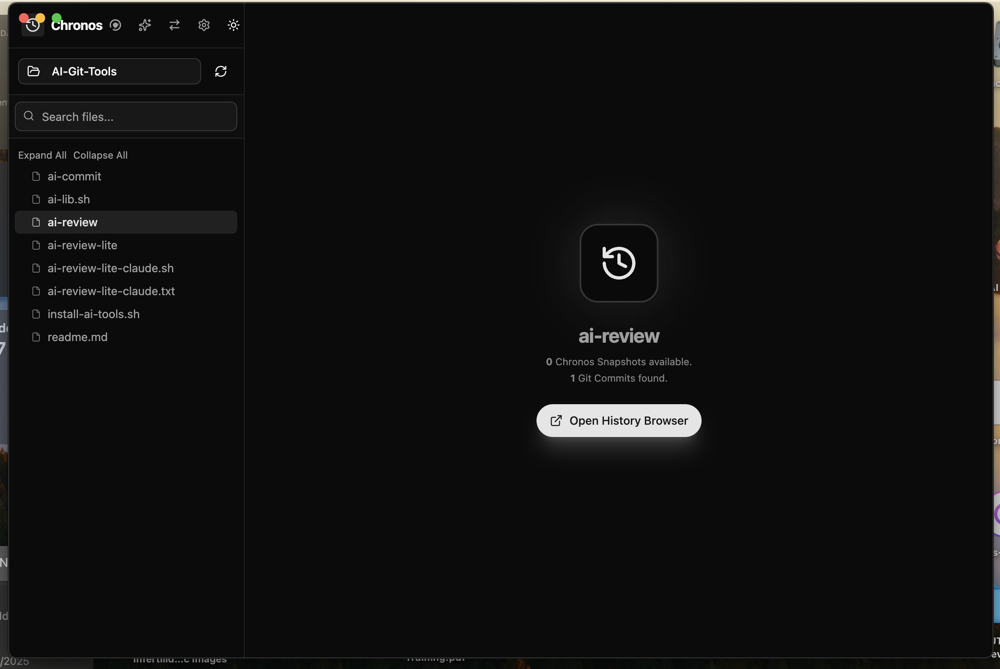

# ChronosHistoryDiff

**ChronosHistoryDiff** is a high-performance desktop application focused on local history tracking and version comparison. It provides an intuitive interface for navigating file changes over time, featuring editable side-by-side Monaco diffs and powerful comparison tools.


## 🔌 Standalone Power & VS Code Synergy

ChronosHistoryDiff is built for flexibility. It can function perfectly as a **standalone application** or in a powerful **[tandem with the VS Code extension](https://github.com/ilidio/Chronos)**.

*   **Solo Mode**: Use it as your primary tool for navigating local file history and performing deep diff analysis across your project's timeline.
*   **Synergy Mode (Local History)**: Pair it with the **Chronos History VS Code extension** to unlock local file snapshots ("store localhost"). The extension captures your edits in real-time, while this desktop app provides the full-screen visualization and comparison environment to restore or analyze that local history.

## 🚀 Key Features

*   **📝 Interactive Diff Viewer**:
    *   **Side-by-Side** Diff Views with syntax highlighting, powered by Monaco Editor.
    *   Compare current working files against Chronos local history snapshots or Git commits.
    *   Option to pin a version for continuous comparison against other history entries.
    *   **Editable Diff**: Make changes directly within the diff view and save them back to the working file.
    *   **Selection-based History**: Filter history to show changes relevant to a selected line range or search term.
*   **📂 File Explorer & History Navigation**:
    *   Browse your project files and view their Chronos local history and Git commit history.
    *   Filter files by search term.
    *   Pin specific local snapshots or Git commits for easy comparison.
*   **🔍 Deep History Search (Grep)**: Powerful search functionality to find content across your project's history.
*   **💡 Daily Progress Briefing**: Generate an AI-powered summary of your daily work based on Git commits.
*   **⚙️ Customizable Settings**: Adjust application settings to suit your workflow.
*   **↔️ Compare Any Files**: A dedicated dialog to compare any two files in your project.
*   **🌓 Theming**: Toggle between light and dark modes for comfortable viewing.

## 🛠️ Development

To start the application in development mode:

```bash
# Install dependencies
npm install

# Run development server (Next.js + Electron)
npm run dev
```

**Note:** In development mode (`npm run dev`), the application menu bar on macOS will display **"Electron"** instead of "ChronosHistoryDiff". This is a standard behavior of the Electron runner. To see the correct branding, you must build the application for production.

## 📦 Production Build

To create a standalone application package (e.g., `.dmg` for macOS, `.exe` for Windows, or `.AppImage` for Linux):

```bash
# Build the application
npm run dist
```

This command will:
1.  Build the Next.js application.
2.  Package the Electron app using `electron-builder`.
3.  Output the installers to the `dist/` directory.

### 🍎 Troubleshooting (macOS)

If you find that the packaged application is unable to load Git history or run Git commands, it is likely because you haven't agreed to the Xcode license agreement on your system.

To fix this, run the following command in your terminal and type `agree` when prompted:

```bash
sudo xcodebuild -license
```

**Why build?**
-   **Correct Branding**: The menu bar will correctly show **"ChronosHistoryDiff"**.
-   **Performance**: The app runs optimized production code.
-   **Portability**: You get a single installable file.

## 🏗️ Tech Stack

*   **Framework**: [Electron](https://www.electronjs.org/) + [Next.js](https://nextjs.org/)
*   **UI Library**: [React](https://react.dev/) + [Shadcn/UI](https://ui.shadcn.com/)
*   **Styling**: [Tailwind CSS](https://tailwindcss.com/)
*   **Editor**: [Monaco Editor](https://microsoft.github.io/monaco-editor/) (Diff View)

## 📄 License

Private / Proprietary

## 🖼 Screenshots



